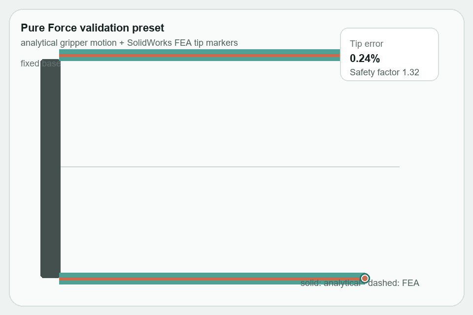
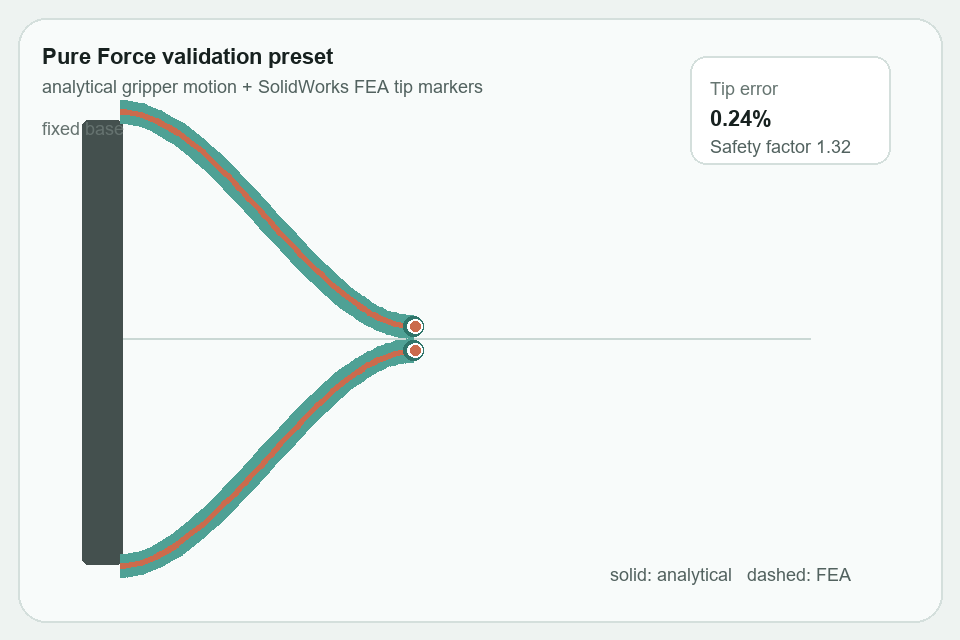

# PRB 3R Compliant Beam Analysis

This project implements an analytical pseudo-rigid-body 3R model for a large-deflection compliant cantilever beam subjected to combined tip force and tip moment loading.

The ASME paper folder is located at:

```text
ME7751-Course-Project-2-Paper
```

Final paper-ready analytical figures are copied to:

```text
ME7751-Course-Project-2-Paper/Figures/Final_Analytical
```

The paper source files are not modified by this project.

## Setup

Use Python 3.11 or newer.

Create and activate a virtual environment from the repository root:

```powershell
python -m venv prb3r_compliant_beam_analysis/.venv
prb3r_compliant_beam_analysis/.venv/Scripts/Activate.ps1
```

Install requirements:

```powershell
python -m pip install -r prb3r_compliant_beam_analysis/requirements.txt
```

## Run

Generate all verification outputs and paper-ready figures:

```powershell
python prb3r_compliant_beam_analysis/scripts/generate_all_figures.py
```

Generate the cleaned final analytical paper outputs:

```powershell
python prb3r_compliant_beam_analysis/scripts/generate_final_analytical_outputs.py
```

Run tests:

```powershell
pytest prb3r_compliant_beam_analysis/tests
```

## Outputs

Run folders contain exploratory diagnostics and dated analysis runs. Current run CSV outputs are written to:

```text
prb3r_compliant_beam_analysis/results/csv/Run 3
```

Current run figures are written to:

```text
prb3r_compliant_beam_analysis/results/figures/Run 3
```

Cleaned final analytical summary files and figures intended for paper use are written to:

```text
prb3r_compliant_beam_analysis/results/csv/Final_Analytical
prb3r_compliant_beam_analysis/results/figures/Final_Analytical
```

Final analytical PNG and PDF figures are copied to:

```text
ME7751-Course-Project-2-Paper/Figures/Final_Analytical
```

The scripts do not modify the LaTeX paper files.

Expected generated CSV files:

```text
basic_verification.csv
tip_locus_atlas_phi90.csv
prb3r_vs_beam_phi90.csv
prb3r_force_angle_sweep.csv
```

Expected paper figure files:

```text
continuous_beam_tip_loci_phi90.png
continuous_beam_tip_loci_phi90.pdf
prb3r_vs_continuous_beam_phi90.png
prb3r_vs_continuous_beam_phi90.pdf
prb3r_tip_error_vs_theta_phi90.png
prb3r_tip_error_vs_theta_phi90.pdf
prb3r_max_error_by_kappa.png
prb3r_max_error_by_kappa.pdf
prb3r_force_angle_sweep_kappa0.png
prb3r_force_angle_sweep_kappa0.pdf
```

## Mathematical Summary

The continuous beam model uses nondimensional load parameters:

```text
alpha = F0*l^2/(2*E*I)
beta = M0*l/(E*I)
kappa = beta^2/(4*alpha)
```

For finite `kappa`, the tip coordinates are computed from quadrature ratios using:

```text
g(theta) = cos(theta0 - phi) - cos(theta - phi) + kappa
```

The pure moment case is treated separately as a circular arc:

```text
Qx = sin(theta0)/theta0
Qy = (1 - cos(theta0))/theta0
beta = theta0
alpha = 0
```

The PRB 3R approximation uses four rigid links, three revolute joints, and three nondimensional torsional spring constants. Radians are used throughout.

## FEA Results Processing

The completed SolidWorks FEA CSV is expected at:

```text
prb3r_compliant_beam_analysis/results/csv/FEA_Results/fea_results_filled.csv
```

The CSV intentionally has a first title/instruction row. The FEA processing script reads it with:

```python
pd.read_csv(path, skiprows=1)
```

Run the FEA comparison workflow from the repository root:

```powershell
python prb3r_compliant_beam_analysis/scripts/compare_fea_results.py
```

Output CSV files are written to `prb3r_compliant_beam_analysis/results/csv/FEA_Results`:

```text
fea_reference_cases.csv
fea_comparison_summary.csv
fea_summary_statistics.csv
```

Output figures are written to `prb3r_compliant_beam_analysis/results/figures/FEA_Results` and copied to `ME7751-Course-Project-2-Paper/Figures/FEA_Results`:

```text
fea_tip_error_by_case.png
fea_qx_qy_comparison.png
fea_tip_loci_comparison.png
fea_max_stress_by_case.png
fea_stress_safety_factor.png
fea_tip_error_vs_theta.png
```

The FEA runs did not collect `theta0_fea_rad`, so the comparison focuses on normalized tip position and stress results rather than slope error.

## Interactive App

The canonical project GUI is a static React/Vite app in:

```text
prb3r_compliant_beam_analysis/web_app
```

It presents the beam study as a mirrored compliant gripper application with a large 2D animated visual, a small Three.js 3D preview, curated validation presets, and compact discrepancy/stress metrics. The app uses precomputed analytical and SolidWorks FEA project data. It does not run Python, SciPy, Streamlit, or a backend in the browser.

Deployed app:

```text
https://maxheil5.github.io/prb3r_compliant_beam_analysis/
```

Pure Force preset preview:



Static app preview:



The app satisfies the project GUI checklist:

```text
parameter modification
analytical predictions
FEA data display
discrepancy quantification
visual comparison
```

Export static app data from the repository root:

```powershell
python prb3r_compliant_beam_analysis/scripts/export_web_app_data.py
```

Run the app locally:

```powershell
cd prb3r_compliant_beam_analysis/web_app
npm install
npm run dev
```

If PowerShell blocks `npm.ps1`, use:

```powershell
npm.cmd install
npm.cmd run dev
```

Build and check the hosted app:

```powershell
npm run check
npm run build
```

Static app data is written to:

```text
prb3r_compliant_beam_analysis/web_app/public/data
```

The app is deployed to GitHub Pages by:

```text
.github/workflows/deploy-prb3r-web-app.yml
```

FEA values outside the 10 completed SolidWorks validation cases should be treated as nearest-case or data-based representations, not new FEA simulations.
